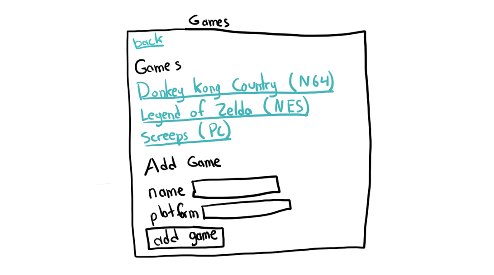
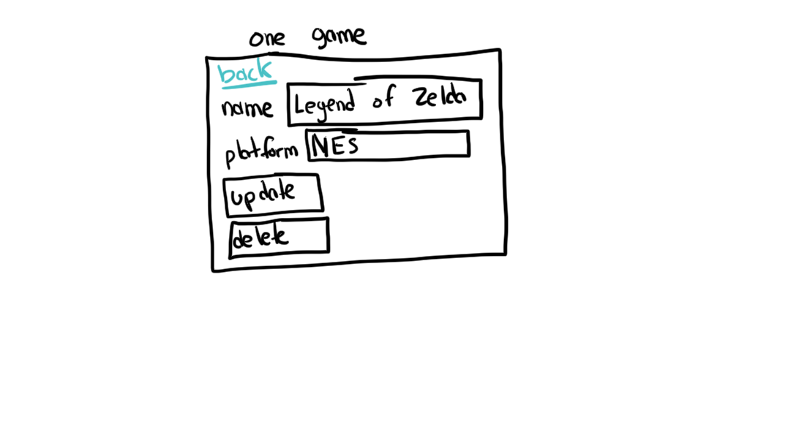
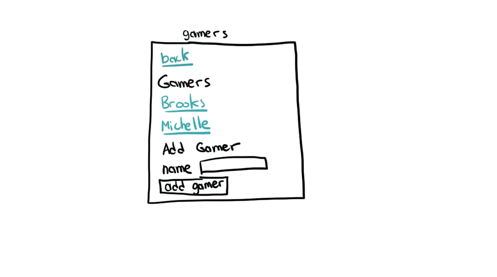
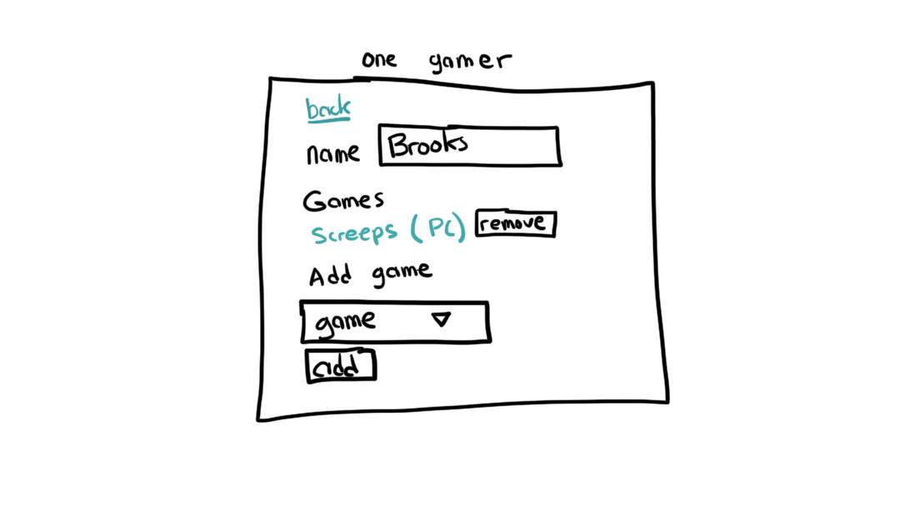

### Deployed site
https://clark-walker-galvanize-games.herokuapp.com/

# galvanize-games-scrimmage
Welcome to Galvanize Games. Galvanize is pivoting once again and is getting
into the video games industry. We aren't going to be making games, but rather
tracking what games each gamer is playing. As such we need you to write a web
app.

## Instructions

Read through this entire document carefully and be sure to follow all of the instructions.  

Fork and clone this repo. Then create the application using the wireframes and requirements below. Pull request your final app when you are finished by the deadline.

## Wireframes

The following are the wireframes to follow for this project. Note that styling
is optional.

## Requirements

The following are the requirements for the project. Note
that these are not user stories. We highly suggest
creating user stories from the wireframes and these
requirements as part of the planning process.

* All pages follow the wireframes. Note that styles are not required.
* When clicking on the `gamers` or `games` links on the
landing page, the user is redirected to the appropriate
page.
* Each page other than the landing page has a back
button, clicking on it takes the user to the page that
they previously came from (for example, clicking on
`back` on the `one game` page takes the user to the
`games` page).

#### Games
* On the `games` page all of the games are listed out. They are links that will take the user to the `one game` page.
* A game can be added to the database through the `add game` form on the `games` page.
* The game can be updated on the `one game` page.
* The game can been deleted on the `one game` page.

#### Gamers
* All of the gamers can be viewed on the `gamers` page. They are all links that will take the user to the `one gamer` page.
* A gamer can be added to the database on the `gamers` page.
* All of the games associated with the gamer can be seen on the `one gamer` page.
* A game can be removed from the gamer on the `one gamer` page.
* A game can be added to the gamer on the `one gamer` page.
* The entire project should be deployed to Heroku

### Stretch goals

The following are not required, but if you **finish** the project, and have **submitted your PR**, then tackle these requirements next:

* Style the front end.
* Make the gamer editable on the `one gamer` page.
* Add authentication so that gamers cannot add games to other gamers
* Allow gamers to comment on the `one game` page.
* Manipulate data to remove duplicates.

## Skills

This project is meant to show off the skills that you have learned and are able to do. Here is a list of technical skills that we will be looking for.

* Creating an Express server
* Rendering HTML through Handlebars
* Setting up a database with knex migrations and seeds
* Express routes (in app.js or a separate routes folder)
* Knex query to get all
* Knex query to get one
* Knex insert
* Knex update
* Knex delete
* Knex joins
* Deploying to Heroku

## Tips

* Take your time to plan things out. Create user stories, and flowcharts.
* Ask for help after 30 minutes or so of being stuck
* Take a break before asking for help, coding for too long doesn't help our creative side
* Deploy to Heroku early and often
* If the instructions feel vague, ask for clarification
